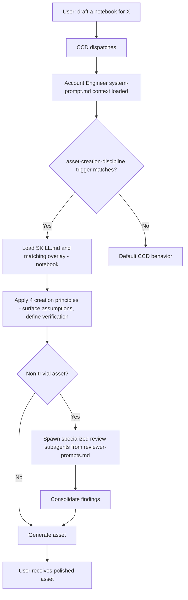

# Architecture

How the Account Engineer profile composes.

## High-Level View

```
                  Cortex Code Desktop
                          |
            +-------------+-------------+
            |             |             |
       Default        Profile       User local
       CCD prompt   (this repo)    overrides
            |             |             |
            +------+------+             |
                   |                    |
          Effective behavior <----------+
```

Cortex Code Desktop applies three layers of behavior:

1. **Default CCD** — the base agent: tool definitions, plan-mode mechanics, todo discipline, memory, etc.
2. **Profile (this repo)** — narrows defaults toward Account Engineer work via system prompt + skills + commands.
3. **User-local overrides** — anything in the user's home dir (custom AGENTS.md, additional skills, memory files) layers on top.

The profile is **additive**: it adds behavior; it does not remove default capabilities.

## What's in the Profile

```
account-engineer-profile/
├── profile.json          # CCD reads this to bootstrap the profile
├── system-prompt.md      # ACE-flavored global overlay
├── docs/                 # principles, patterns, policies (NOT auto-loaded; referenced)
├── skills/               # CCD scans this directory; each subdir = one skill
├── commands/             # CCD scans this directory; each .md = one slash command
└── examples/             # sanitized exemplar assets (reference only)
```

### profile.json

The manifest CCD reads when you create or update the profile via the form. It points at sub-paths of this repo for skills, commands, system prompt. Updates land when you re-save the profile in CCD.

### system-prompt.md

A short overlay that tells the agent it's running under the Account Engineer profile and lays down the must-follow defaults: `snowflake_product_docs` verification, write-scope policy, warehouse policy, Salesforce read-only, public-repo hygiene.

It does NOT replace the default CCD prompt. It adds a layer on top.

### docs/

Reference documentation. Not auto-loaded by CCD — the system prompt and skills point at these docs, and the agent reads them on demand.

| Doc | Purpose |
|---|---|
| `karpathy-coding-principles.md` | Four principles for any individual change (think before, simplicity, surgical, goal-driven) |
| `ai-dev-patterns.md` | Thirteen patterns for team-of-agents workflow + four patterns layered on for non-coding |
| `ace-onboarding.md` | What a new ACE does right after installing the profile |
| `public-repo-policy.md` | What can never appear in this repo |
| `architecture.md` | This document |

### skills/

CCD auto-discovers skills here. Each subdirectory contains a `SKILL.md` with YAML front-matter declaring triggers and a workflow. v0.1.0 ships one skill: `asset-creation-discipline`.

### commands/

Slash commands. Empty placeholder in v0.1.0; populated in Phase 4.

### examples/

Sanitized exemplar assets a contributor can read for inspiration. Empty placeholder in v0.1.0.

## How a Request Flows



## How Discipline Layers Compose

The profile carries two complementary discipline layers:

| Layer | Source doc | Scope | Applied when |
|---|---|---|---|
| Macro: workflow patterns | `docs/ai-dev-patterns.md` | Team-of-agents orchestration; planning; review structure | Multi-step tasks; non-trivial assets |
| Micro: per-change principles | `docs/karpathy-coding-principles.md` | Individual edit / generation moment | Every single change, code or content |

The asset-creation-discipline skill applies BOTH layers to creation tasks. The system prompt references both layers as defaults.

## How v0.1.0 Becomes a Mature Profile

| Phase | What lands | New surface area |
|---|---|---|
| 1 (this release) | Repo + system prompt + asset-creation-discipline skill | Discipline kicks in on creation requests |
| 2 | Read-only skills migrated (snowflake-pdf, architecture-diagram, gdrive-desktop, gong, similar-use-cases, pptx) | Specific tooling for PDF, diagrams, Gong, decks |
| 3 | Personal-data skills sanitized + migrated (account research, meeting prep, use-case data, etc.) | Full ACE workflow set |
| 4 | Slash commands (multi-review, start-asset, public-repo-review) + sanitized examples | Faster invocation of common patterns |
| 5 | Onboard a second ACE; iterate on feedback | Validates ways of working |

## Out of Scope (For This Profile)

- Project-specific tooling — stays in the relevant project's own repo
- Personal slack/notification skills — stay local
- Personal curriculum / study skills — stay local
- Any single-engagement utilities — stay local

The profile is the **role-shaped baseline**. Personal customization layers on top.
