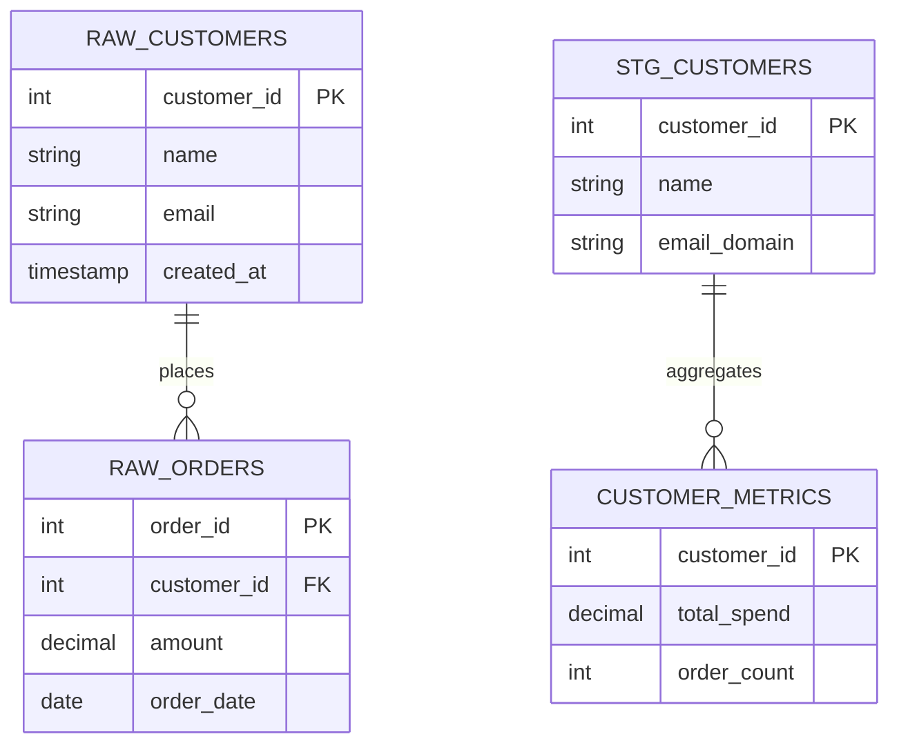
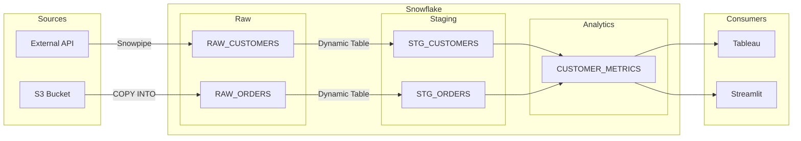
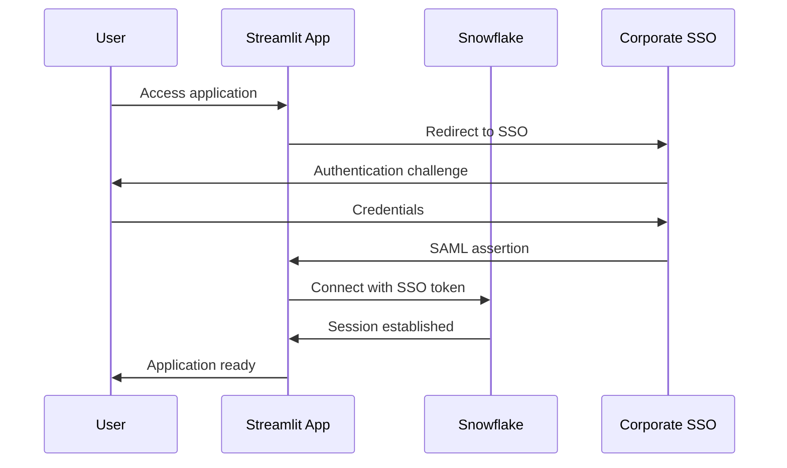

# Architecture Diagrams

## Purpose
Architecture diagram specifications for Snowflake projects. Diagram requirements scale with project complexity.

## When to Use
- Starting a new project (create diagrams)
- Adding new components (update diagrams)
- Code reviews (verify diagram accuracy)
- Project audits (validate diagrams exist)

## Skill Delegation (MANDATORY)

**BEFORE creating diagrams, invoke these prerequisite skills:**

1. **`sfe-demo-standards`** - Review naming conventions and documentation standards
   - Checkpoint: Layer prefixes match? (RAW_, STG_, analytics)
   - Checkpoint: Schema names follow patterns?
   - Checkpoint: SE Community attribution?
   - Checkpoint: 30-day expiration for demos?

**Pattern:** Match diagram complexity to project scope.

## Guidelines

### Tiered Diagram Requirements

**Not all projects need all diagrams.** Match documentation to project complexity:

| Project Type | Required Diagrams | Optional |
|--------------|-------------------|----------|
| **Simple Demo** | data-flow | data-model |
| **Feature Demo** | data-flow, data-model | - |
| **Production Project** | All 4 diagrams | - |
| **Customer-Facing** | data-model, data-flow | auth-flow |

**Rule:** Don't over-engineer documentation. A simple Cortex Agent demo doesn't need network-flow or auth-flow diagrams.

### Directory Structure

**Monorepo:**
```
<type>-<name>/
├── diagrams/
│   ├── data-model.md      # Schema relationships
│   ├── data-flow.md       # Data movement (RECOMMENDED for all)
│   ├── network-flow.md    # Network architecture (production only)
│   └── auth-flow.md       # Auth mechanisms (if custom auth)
└── .claude/
    └── DIAGRAM_CHANGELOG.md
```

**Standalone:**
```
project/
├── diagrams/
│   ├── data-model.md
│   ├── data-flow.md
│   ├── network-flow.md
│   └── auth-flow.md
└── .claude/
    └── DIAGRAM_CHANGELOG.md
```

### Diagram Types (4 Total)

#### 1. Data Model (`diagrams/data-model.md`)

**Shows:** Database schema and relationships

**Must Include:**
- All tables in each schema
- Layer prefixes: `RAW_<entity>`, `STG_<entity>`, `<entity>`
- Primary keys (PK) and foreign keys (FK)
- Relationships (one-to-many, etc.)

**Format:** Mermaid erDiagram

#### 2. Data Flow (`diagrams/data-flow.md`)

**Shows:** How data moves through the system

**Must Include:**
- Data sources (APIs, S3, etc.)
- Ingestion paths (Snowpipe, COPY, streaming)
- Transformation layers (raw → staging → analytics)
- Data sinks (apps, BI tools)

**Format:** Mermaid flowchart

#### 3. Network Flow (`diagrams/network-flow.md`)

**Shows:** Network architecture and connectivity

**Must Include:**
- External systems
- Network boundaries
- Firewall rules, security groups
- Load balancers, proxies
- Port numbers and protocols

**Format:** Mermaid flowchart

#### 4. Auth Flow (`diagrams/auth-flow.md`)

**Shows:** Authentication and authorization

**Must Include:**
- Auth methods (OAuth, JWT, key-pair)
- Authorization boundaries
- Token generation/validation
- Role-based access control
- Credential storage

**Format:** Mermaid sequenceDiagram

### Diagram Header Requirements

Every diagram MUST include this header:

```markdown
# [Diagram Type] - [Project Name]

Author: SE Community
Last Updated: [YYYY-MM-DD]
Expires: [YYYY-MM-DD] (30 days from creation)
Status: Reference Implementation


Reference Implementation: Review and customize for your requirements.

## Overview
[2-3 sentence description]

## Diagram
[Mermaid code block]

## Component Descriptions
[Description of each component]

## Change History
See `.claude/DIAGRAM_CHANGELOG.md` or project-specific changelog.
```

## Mermaid Examples

### Data Model (erDiagram)



### Data Flow (flowchart)



### Auth Flow (sequenceDiagram)



## Cross-References
- Related skill: `sfe-demo-standards` - For naming conventions and documentation standards
