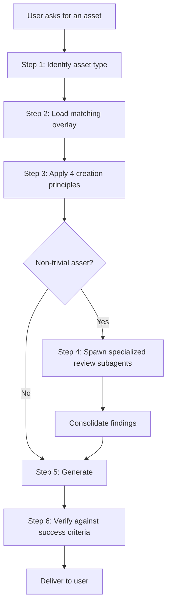

# Asset Creation Discipline

This skill applies coding-grade rigor to non-coding creation work. It exists because LLMs share three failure modes when generating assets:

1. They make wrong assumptions silently and run with them.
2. They overcomplicate output, adding speculative sections nobody asked for.
3. They make drive-by edits beyond the requested change.

The discipline counteracts these failure modes via four principles applied per change, plus optional specialized review subagents for non-trivial assets.

---

## When to Apply Full Discipline

Apply the full workflow when the user asks for any of:

- A PDF guide / runbook / troubleshooting doc / briefing
- A notebook (Jupyter / Snowflake notebook)
- A script (shell, Python, SQL pipeline)
- A slide deck or visual artifact
- A research summary or design document
- An architecture review or technical recommendation
- A customer-facing deliverable of any kind

For trivial requests (a one-line script, a typo fix, a quick lookup), use judgment — the full ritual is overkill.

---

## The Workflow

### Step 1: Identify the asset type

| User says... | Overlay |
|---|---|
| PDF, runbook, guide, doc, briefing, troubleshooting, customer-facing document | `overlays/pdf.md` |
| notebook, .ipynb, jupyter, analysis notebook, exploration notebook | `overlays/notebook.md` |
| script, automation, pipeline, shell script, python script, SQL pipeline | `overlays/script.md` |
| research, design, recommendation, architecture, evaluation, comparison | `overlays/research-design.md` |

If the request straddles multiple types, pick the dominant one and note the others in your initial questions to the user.

### Step 2: Load the matching overlay

Read the overlay. Each overlay has:

- A reminder of the four principles applied to this asset type
- A recommended skeleton for that asset type
- Quality checks specific to that asset type

### Step 3: Apply the four creation principles in order

Detail in `creation-principles.md`. Summary:

1. **Think Before Creating** — surface assumptions, ask about ambiguity, present interpretations
2. **Minimum Viable Asset** — smallest deliverable that meets the goal
3. **Surgical Edits** — when revising, touch only what changed
4. **Verification-Driven Output** — every section/cell/step has a check

If you cannot answer the principle 1 questions on your own, **stop and ask the user**.

### Step 4 (non-trivial assets): Spawn specialized reviewers

Use `runSubagent` (or the equivalent) to spawn the reviewer set from `overlays/reviewer-prompts.md` matching the asset type. Run in parallel where the tool supports it. Consolidate findings before showing to the user.

Skip this step for trivial assets.

### Step 5: Generate

Generate the asset following the overlay's skeleton.

### Step 6: Verify

Run the asset's verification check (run the script, render the PDF, execute the notebook, follow the steps). Apply Karpathy Principle 4: weak success criteria mean you can never declare done; strong criteria let you loop until verified.

---

## Reference Documents

| Doc | Purpose |
|---|---|
| `creation-principles.md` | The four principles in depth, with examples |
| `creation-patterns.md` | Workflow patterns adapted from ai-dev-patterns.md for non-coding work |
| `overlays/pdf.md` | PDF-specific principles + skeletons |
| `overlays/notebook.md` | Notebook-specific principles + checks |
| `overlays/script.md` | Script-specific principles + checks |
| `overlays/research-design.md` | Research/design-specific principles + tradeoff template |
| `overlays/reviewer-prompts.md` | Copy-paste subagent prompts per asset type |

---

## Composes With

- **snowflake-pdf skill** (Phase 2): when the asset is a PDF, after applying this skill's discipline, hand off to `snowflake-pdf` for actual rendering with audience workflow + reference validation.
- **architecture-diagram skill** (Phase 2): when an asset needs a diagram, the diagram skill applies its own conventions; this skill ensures the surrounding doc applies the four principles.
- **pptx skill** (Phase 2): same pattern as snowflake-pdf — discipline first, render second.

---

## Anti-Pattern: When the Discipline Becomes Theater

The discipline exists to reduce mistakes, not to pad responses. Anti-patterns to avoid:

- Asking the user assumption-surfacing questions where the answer is obvious from context
- Spawning multi-reviewer subagents on a trivial change
- Listing the four principles in every response without applying them
- Rejecting requests as "non-trivial" to justify ceremony when the user wants speed

If a user explicitly asks for a quick draft, deliver it. The discipline kicks in for thoughtful work, not as a tax on every interaction.
