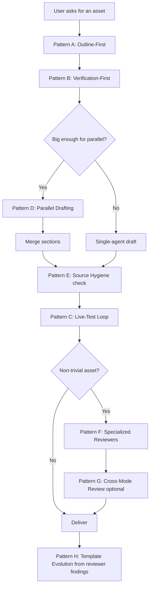

# Creation Patterns

Workflow patterns for creating assets. Adapted from the team-of-agents patterns in [docs/ai-dev-patterns.md](../../docs/ai-dev-patterns.md), generalized to apply to PDF guides, notebooks, scripts, decks, and research/design work.

The original 13 patterns target software development. The patterns below are the subset that translate cleanly to non-coding creation work.

---

## Pattern A: Outline-First (was Pattern 2: Spec-First)

**Don't start with prose. Start with a structure.**

For any asset more than ~50 lines / ~3 sections / ~1 cell, sketch the outline first:

| Asset | What "outline" means |
|---|---|
| PDF | Table of contents, section headers, one-line summary of each section's purpose |
| Notebook | List of cells with one-line description of each cell's purpose |
| Script | List of functions with their inputs/outputs/side effects |
| Research / Design | Question -> options -> evaluation criteria -> recommendation skeleton |

Get the outline approved (or at least reviewed) before drafting content. English / outline form is faster to review than 5,000 words of prose or 30 cells of code.

---

## Pattern B: Verification-First (was Pattern 3: Test-First)

**Define what "done" looks like before producing.**

Before drafting:

- For each procedure in a guide: write the "you should now see X" check
- For a notebook: write the final cell (the result) and work backwards
- For a script: write the test command and expected output
- For research: write the recommendation template ("After reading, the audience should be able to decide between A, B, and C") and work backwards

This is Karpathy Principle 4 applied at the workflow level: strong success criteria let the agent loop independently.

---

## Pattern C: Live-Test Loop (was Pattern 4: Feedback Loops)

**Validate against real systems, not assumptions.**

Don't ship the asset until you've observed it working:

| Asset | Live-test action |
|---|---|
| PDF guide | Render to PDF, scan for layout breakage; if it has procedures, run at least the first procedure |
| Notebook | Restart kernel, run all, observe outputs |
| Script | Run with real inputs (or sanitized stand-ins); check exit code and output |
| Research | Sanity-check the citations open and say what you claim they say |

A LLM that never observes its output's effect repeats the same mistakes forever.

---

## Pattern D: Parallel Drafting (was Pattern 5: Worktrees)

**Multiple agents drafting different sections simultaneously.**

For large assets:

- Section A goes to one subagent
- Section B goes to a second subagent
- A coordinator agent (or you) merges and reconciles voice

Best for assets where sections are largely independent (a multi-IdP setup guide, a research summary covering multiple options, a deck with separate topic groups).

Don't use parallel drafting for assets where sections must flow narratively from each other — sequential is faster than reconciling diverging voices.

---

## Pattern E: Source Hygiene (was Pattern 8: Context Management)

**Don't dump 45k tokens of unfiltered context into the agent.**

When pulling source material for an asset:

- Curate which docs / queries / call notes go into context
- Summarize before stuffing if a source is long and only partially relevant
- Cite explicitly so the asset's reader can trace back

Anti-pattern: pasting an entire Confluence page when only one section matters. The agent will weight the irrelevant parts.

---

## Pattern F: Specialized Reviewers (was Pattern 11: Multi-Reviewer)

**Different reviewer roles per asset type.**

For non-trivial assets, spawn parallel review subagents — each with one specific job. See `overlays/reviewer-prompts.md` for the prompt library.

| Asset | Default reviewer set |
|---|---|
| PDF | Technical accuracy, audience-fit, completeness, security, clarity, reproducibility |
| Notebook | Reproducibility, output cleanliness, cell cohesion, dependency hygiene |
| Script | Failure modes, secrets hygiene, idempotency, observability |
| Research / Design | Assumption surfacing, tradeoff coverage, source quality, bias check |

Run reviewers in parallel via `runSubagent`. Consolidate findings before showing the user.

---

## Pattern G: Cross-Mode Review (was Pattern 12: Cross-Model Review)

**Different perspective sources catch different blind spots.**

Within Cortex Code Desktop's Claude family:

- One reviewer with deep / careful settings (Opus-style)
- One reviewer with broad / fast settings (Sonnet-style)

If they agree, confidence rises. If they disagree, the disagreement is the signal — investigate.

When CCD adds support for multi-vendor models, expand this pattern.

---

## Pattern H: Template Evolution (was Pattern 13: Continuous Improvement)

**When reviewers consistently flag the same issue, update the template.**

If multiple PDF reviews flag the same kind of problem (missing prereq sections, weak verification steps, vague audience), update `overlays/pdf.md` so future PDFs avoid it.

If notebook reviewers consistently flag the same issue (forgotten kernel restart test, hardcoded paths), update `overlays/notebook.md`.

The discipline itself is subject to continuous improvement. The skill should evolve as you learn what produces good assets.

---

## Patterns That Don't Translate Cleanly

These coding patterns apply less to non-coding creation work, listed for completeness:

- **Pattern 1 (Write Skills):** the skill IS itself the asset; not a separate authoring activity
- **Pattern 6 (Task Graphs):** rarely needed for single assets; useful when an asset depends on multiple research or extraction steps
- **Pattern 7 (Subagents):** subsumed by Pattern F (Specialized Reviewers) and Pattern D (Parallel Drafting)
- **Pattern 9 (Multi-Model Teams):** subsumed by Pattern G (Cross-Mode Review)
- **Pattern 10 (PR-Based Code Review):** versioning of assets often happens in document tools (Google Docs comments) rather than git; the spirit applies but the mechanism differs

---

## How These Compose

Not every asset needs every pattern. Use judgment proportional to the stakes and complexity.

---

## Cross-References

- [creation-principles.md](creation-principles.md) — the four per-change principles
- [overlays/pdf.md](overlays/pdf.md), [overlays/notebook.md](overlays/notebook.md), [overlays/script.md](overlays/script.md), [overlays/research-design.md](overlays/research-design.md) — domain applications
- [overlays/reviewer-prompts.md](overlays/reviewer-prompts.md) — reviewer prompt library
